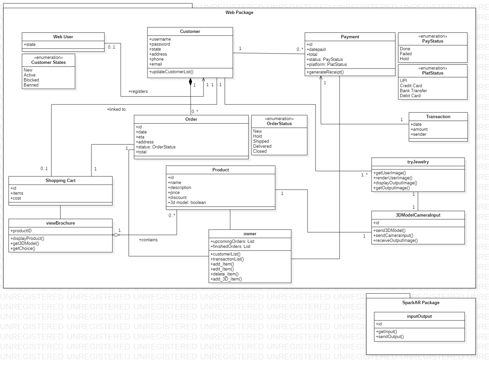

# Jewelstore (AR Jewelry E-Commerce Store)

## Project Sponsor - Siddhi Jewellers
# Problem Statement
['Homemakers in rural India hold over 11% of the actual amount of gold in the world. Consequently, Indian women collectively wear over 21,000 tons of gold on their bodies. To put this figure into perspective, the Indians’ obsession with gold has pushed them to accumulate more gold than all the reserves of the IMF, USA, Germany, and Switzerland put together.'](https://blog.novemgold.com/interesting-fact-indian-housewives-hold-11-of-the-worlds-gold/) However, almost all of the jewelry shopping is done traditionally. This is a market longing for a disruption. ['Only 7.6% of the global jewelry shopping was done online and India only had an online penetration of 1.2%'](https://retailjewellerindia.com/how-big-is-the-online-jewellery-market-in-india/). What could be the reasons of such low market penetration in online jewelry shopping? 

 - **Trust**
 *The majority of people still don't buy gold or diamonds without visiting a shop. Jewelry is a luxury purchase and is an investment for any Indian household. They don't want to take risks. They want to choose the best design, check on the purity of gold, see its make in reality and then make a decision.*
 - **Can't experience the touch and feel**
 *Not being able to try on rings and other jewelry. Not seeing the actual product to check the quality of the item you want to buy.*
 
 There could be countless other reasons and factors, but we aim at solving these two for our client **Siddhi Jewellers**. They are trusted by their clients, but what if we can elevate the trust using technology. What if we can integrate Augmented Reality with Jewelry Shopping? This idea was the motivator of this project. Combining something as fresh as AR into something as traditional as Jewelry shopping. It is undeniable that Indians love hoarding jewelry. Many consider gold and diamond an investment and technology is meant to solve our problems. We aim at solving this problem using technology. 

Our objective is to provide an experience to the customers of **Siddhi Jewellers**. Making a seamless and realistic web-based experience to the customers. Making browsing, ordering, trying, and payment - secure, trusted and reliable for both the owner and the customer. 

### How does this helps the customer?
- This project will make the browsing of available products easier and efficient. 
- They will be able to view a realistic **3D scan** of the jewelry.
- They will be able to try the **3D scan** on their faces.

### How does this helps the owner?
- This will be able to scale the business and leverage internet to find customers from different cities & states as well.
- This project will help the owner to maintain and track all the transactions on a digital ledger.
- This project will help the owner to maintain and update a list of all the customers and their details. This can be used for promotional purposes as well.
## Probable Actors

1.  **Customer** -
    1.  View, Order, Try various jewelries available on the brochure
2.  **Owner/Admin** -
    1.  Add, Update, Delete jewelries and stocks
    2.  View Customers and Orders
    3.  View Transaction Histories

## Usecase Diagram & Descriptions

### Usecase Diagram
.vpd.png)

### Usecase Descriptions

### 1 (To be reviewed)

| Use Case Name:        	|   Try Jewelry 	|
|-----------------------	|---	|
| Primary Actor:            	|   Customer	|
| Description:            	|   This use case helps the customer try jewelries on their screen using the help of **Augmented Reality**	|
| Relationships:            	|   <ui>**Included in** <li>Order Jewelry </li> <ui>**Extends** <li>Get camera permission </li><li>Handle AR errors</li>	|
| Triggering Event:     	|   <ui><li>Customer selects any product to try</li><li>Customer orders any product, then they must try it before checkout </li>	|
| Preconditions:        	| <ui><li>Customer must be logged in in the system </li><li>Customer must have a camera in their device </li> <li>Customer should be in a well lit area </li> |
| Postconditions:       	|   If the use case was successful, the actor is now logged into the system. If not the system state is unchanged.	|
| Basic Flow:   	| <ul><li>Customer selects the try jewelry button </li><li>System scans the customer's face</li><li>System processes and applys the  _3D_  jewelry model on the customer's face</li><li>Customer can proceed or run the scan again </li>	|
| Exception Conditions: 	|   <ul><li>System faces any problem to access the customer's camera</li><li>Customer's face is not under adequate lighting for the algorithm to process and apply the  _3D_  model </li>|

### 2 (To be reviewed)

| Use Case Name:        	|   View Transaction History	|
|-----------------------	|---	|
| Primary Actor:            	|   Owner	|
| Description:            	|   This use case allows the owner to see the transactions happened in the given timeframe. 	|
| Relationships:            	|   -	|
| Triggering Event:     	|   Owner selects the view transaction history button |
| Preconditions:        	| Owner must be logged in in the system
| Postconditions:       	| The transactional history gets displayed |
| Basic Flow:   	|  <ul><li>Owner selects the view transaction history button</li><li>System asks for a timeframe </li><li>Owner enters the timeframe </li><li>System scans the database and returns the transactions in the given timeframe</ul> 	|
| Exception Conditions: 	|   <ul><li>The system fails at returning the transactions</li> <li>There is no recorded transactions in the timeframe|

 ## Domain Level Class Diagram
 
